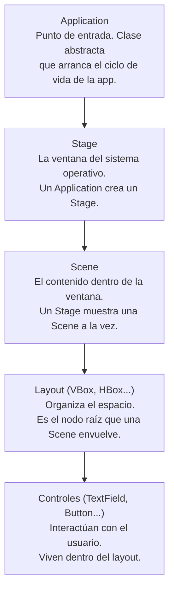

# Conociendo JavaFX desde POO

*Ingeniería de Software · Programación Orientada a Objetos*

---

## 1. Elementos básicos de JavaFX y su relación con POO

### ¿Qué es JavaFX?

JavaFX es el framework moderno de Java para construir interfaces gráficas (GUI). Reemplazó a Swing y está diseñado desde cero con una arquitectura orientada a objetos: cada elemento visual es un objeto con estado y comportamiento propio, no un dibujo procedural.

### Application, Stage, Scene y Node

- **Application**: clase abstracta que se extiende para crear la app. Obliga a implementar `start(Stage primaryStage)` y es el punto de entrada gráfico.
- **Stage**: representa la ventana física del sistema operativo (marco, barra de título, botones). Puede mostrar una `Scene` a la vez, pero se puede cambiar en tiempo de ejecución.
- **Scene**: es el contenido dentro de la ventana. Envuelve un grafo de nodos (Scene Graph) que inicia en un único nodo raíz.
- **Node**: clase base abstracta de todo lo que se puede dibujar: botones, campos de texto, layouts, imágenes, texto.

### Controles y layouts

Los **controles** son `Node` concretos con los que el usuario interactúa (`TextField`, `Button`, `Label`, `CheckBox`, etc.). Los **layouts** también son `Node`, pero su función es organizar espacialmente a otros nodos: `VBox` apila verticalmente, `HBox` horizontalmente, `GridPane` en cuadrícula.

### Eventos y `setOnAction()`

JavaFX funciona con un modelo de eventos. Al hacer clic en un `Button` se dispara un `ActionEvent`. `setOnAction()` recibe un objeto que implementa la interfaz funcional `EventHandler<ActionEvent>` — en la práctica, casi siempre una lambda. Esto es **inversión de control**: en vez de preguntar constantemente si hubo un clic, se entrega el código a ejecutar y el framework lo llama cuando corresponde (patrón Observer).

### Relación con POO

- **Herencia**: `Application` y toda la jerarquía de `Node`.
- **Polimorfismo**: layouts y controles se tratan uniformemente como `Node`.
- **Encapsulamiento**: cada control oculta su estado interno y lo expone mediante métodos (`getText()`, `setText()`).
- **Composición**: una `Scene` se compone de un `Node` raíz, que a su vez se compone de otros `Node`.

---

## 2. Mapa conceptual

**Relación:** `Application → Stage → Scene → Layout → Controles`



```
Application  → Stage → Scene → Layout → Controles
(entra la app) (ventana) (contenido) (organiza) (interactúan)
```

---

## 3. Registro básico de estudiante

Clase modelo `Estudiante` (encapsula nombre y matrícula, expone getters):

```java
public class Estudiante {
    private String nombre;
    private String matricula;

    public Estudiante(String nombre, String matricula) {
        this.nombre = nombre;
        this.matricula = matricula;
    }

    public String getNombre() { return nombre; }
    public String getMatricula() { return matricula; }

    public String mostrarInfo() {
        return "Nombre: " + nombre + "\nMatrícula: " + matricula;
    }
}
```

Pantalla JavaFX: 2 `TextField`, 1 `Button`, `VBox` y evento `setOnAction` que crea el `Estudiante`:

```java
public class RegistroApp extends Application {
    @Override
    public void start(Stage primaryStage) {
        TextField campoNombre = new TextField();
        campoNombre.setPromptText("Nombre completo");

        TextField campoMatricula = new TextField();
        campoMatricula.setPromptText("Matrícula");

        Button botonRegistrar = new Button("Registrar");
        Label resultado = new Label();

        VBox contenedor = new VBox(10);
        contenedor.setPadding(new Insets(20));
        contenedor.getChildren().addAll(
            new Label("Nombre:"), campoNombre,
            new Label("Matrícula:"), campoMatricula,
            botonRegistrar, resultado);

        botonRegistrar.setOnAction(evento -> {
            Estudiante estudiante = new Estudiante(
                campoNombre.getText(), campoMatricula.getText());
            resultado.setText(estudiante.mostrarInfo());
        });

        primaryStage.setScene(new Scene(contenedor, 320, 280));
        primaryStage.show();
    }
}
```

---

## 4. Ventaja de usar una clase `Estudiante`

Usar una clase `Estudiante` en vez de manejar los datos directamente desde los `TextField` separa la responsabilidad de capturar texto crudo (trabajo del `TextField`) de la responsabilidad de modelar el dominio (trabajo de `Estudiante`). La clase `Estudiante` no depende de JavaFX: podría reutilizarse en una app de consola, en un backend o en pruebas unitarias sin cambiar una línea, porque no está atada a la interfaz gráfica.

**Dos conceptos de POO utilizados:**

- **Encapsulamiento**: los atributos `nombre` y `matricula` son `private`; solo se accede a ellos mediante `getNombre()`/`getMatricula()`, evitando que se asignen valores inválidos directamente desde fuera de la clase.
- **Abstracción**: al llamar a `estudiante.mostrarInfo()` no es necesario saber cómo está formado el texto internamente; el objeto sabe presentarse a sí mismo.
